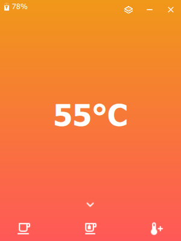

# EmberControl
Small python program to communicate with the Ember Mug.

Ember control main view:

Ember control in overlay mode:

## Features

- [x] Connect to the Ember Mug
- [x] Show current temperature
- [x] Show current battery
- [x] Show current battery charge state
- [x] Set target temperature tea (59°C)
- [x] Set target temperature coffee (55°C)
- [X] Three Temperature Animations
- [x] Implement User Settings

## Installation

Either download a prebuilt .exe from the releases page or build it yourself.
Building the application has been tested Windows 11 with Python 3.10.11
Currently we are using the following [dependencies](requirements.txt): 

    qasync==0.25.0
    bleak==0.21.1
    PyQt5==5.15.9
    
Install dependencies:

    pip install -r requirements.txt

Run the UI with: 

    python main.py

Or build your own .exe using auto-py-to-exe.

## Settings
Current Settings: 
- [x] LED Color 
- [x] Tea Temperature
- [x] Coffee Temperature
- [ ] Custom Preset
- [ ] Temperature Unit

